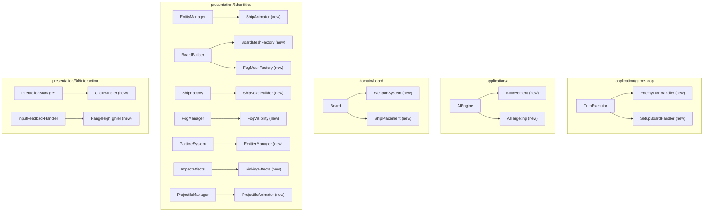
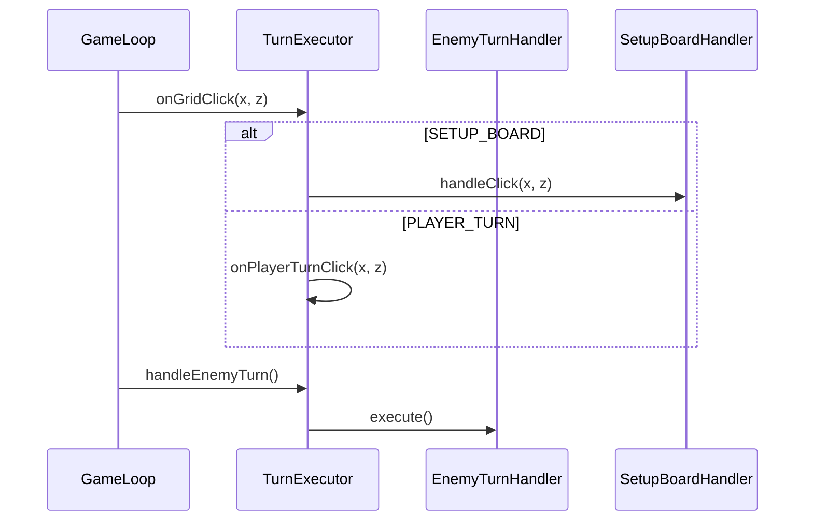

# Design Document: Logic Decomposition

## Overview

This feature systematically decomposes large files in the 3D Voxel Battleships codebase that exceed the 300–400 line threshold established in the project's steering docs. The goal is to improve logic segregation, testability, and maintainability by extracting cohesive responsibilities into dedicated helper classes following the project's established Delegation Pattern.

The project already has successful decomposition precedents: `GameLoop` delegates to `GameEventManager`, `RogueActionHandler`, `MatchSetup`, and `TurnExecutor`; `EntityManager` delegates to `WaterShaderManager` and `VesselVisibilityManager`. This design extends that pattern to the remaining oversized files, ensuring each new helper class owns a single responsibility, communicates via explicit state interfaces or minimal public APIs, and maintains the DDD layer boundaries.

Files below the 300-line threshold (`main.ts` at 278 lines, `Storage.ts` at 238 lines, `UnifiedBoardUI.ts` at 258 lines, `Engine3D.ts` at 262 lines, `hud.css` at 296 lines) are excluded from decomposition as they fall within acceptable limits.

## Architecture

The decomposition follows the existing coordinator → delegate pattern. Each oversized class becomes (or remains) a thin orchestrator that delegates to new focused helpers.

## Components and Interfaces

### 1. TurnExecutor Decomposition (416 lines → ~180 + ~130 + ~110)

**Current state**: `TurnExecutor` handles enemy AI turns, auto-battler player turns, setup board clicks, and player turn clicks — four distinct responsibilities.

**Proposed split**:

| New File | Responsibility | Extracted From |
|----------|---------------|----------------|
| `EnemyTurnHandler.ts` | Enemy turn execution (Classic + Rogue AI logic) | `handleEnemyTurn()` |
| `SetupBoardHandler.ts` | Ship placement during SETUP_BOARD phase | `onSetupBoardClick()` |
| `TurnExecutor.ts` (trimmed) | Player turn click + auto-battler orchestration | Remaining methods |

**Interface**: All handlers receive `TurnExecutorState` (existing interface, no changes needed).

### 2. AIEngine Decomposition (363 lines → ~120 + ~140 + ~110)

**Current state**: `AIEngine` mixes Rogue-mode tactical decisions (move vs attack), movement computation, and attack targeting (easy/normal/hard) in one class.

**Proposed split**:

| New File | Responsibility | Extracted From |
|----------|---------------|----------------|
| `AIMovement.ts` | Rogue-mode movement decisions and pathfinding | `decideAction()`, `computeMove()`, `findVisibleEnemyInRange()` |
| `AITargeting.ts` | Attack target selection (easy/normal/hard heatmap) | `computeNextMove()`, `computeEasyMove()`, `computeNormalMove()`, `computeHardMove()`, `canFitShipExperimentally()` |
| `AIEngine.ts` (trimmed) | Thin coordinator, difficulty config, `reportResult()` | Orchestration + hunt stack |

**Interface**: `AIMovement` and `AITargeting` receive `Board`, `Match`, and difficulty as parameters — pure functions where possible.

### 3. Board Decomposition (305 lines → ~160 + ~80 + ~70)

**Current state**: `Board` handles grid state, ship placement/removal/movement, attack resolution, AND special weapon dispatch (mines, sonar, air strikes).

**Proposed split**:

| New File | Responsibility | Extracted From |
|----------|---------------|----------------|
| `WeaponSystem.ts` | Mine placement, sonar ping, air strike dispatch | `placeMine()`, `placeSonar()`, `sonarPing()`, `dispatchAirStrike()` |
| `ShipPlacement.ts` | Ship placement validation, placement, removal, movement | `canPlaceShip()`, `placeShip()`, `removeShip()`, `moveShip()` |
| `Board.ts` (trimmed) | Core grid state, `receiveAttack()`, `allShipsSunk()` | Attack resolution + state |

**Constraint**: `Board` is in the domain layer — extracted classes must remain framework-free. `WeaponSystem` and `ShipPlacement` operate on `Board` state passed as parameters.

### 4. EntityManager Decomposition (470 lines → ~250 + ~130)

**Current state**: Already delegates to 5 sub-managers but still contains ship animation logic (sinking, movement lerp, highlighting) and sonar effect management inline.

**Proposed split**:

| New File | Responsibility | Extracted From |
|----------|---------------|----------------|
| `ShipAnimator.ts` | Ship sinking descent, movement lerp, highlight pulsing | `updateShipAnimations()`, `updateShipHighlighting()` |
| `EntityManager.ts` (trimmed) | Pure orchestration + event wiring | Remaining coordination |

### 5. BoardBuilder Decomposition (429 lines → ~180 + ~150 + ~100)

**Current state**: Single static `build()` method creates frame, base, brackets, rivets, screws, water planes, grid tiles, fog meshes, raycast planes, and theme listeners — too many concerns.

**Proposed split**:

| New File | Responsibility | Extracted From |
|----------|---------------|----------------|
| `BoardMeshFactory.ts` | Frame, base, brackets, rivets, screws, bottom plane | Frame/base/bracket/rivet/screw creation |
| `FogMeshFactory.ts` | Fog voxel geometry, materials, shader setup, consolidated fog init | Fog-related mesh creation |
| `BoardBuilder.ts` (trimmed) | Orchestrates factories, creates water/grid/raycast planes | Top-level `build()` coordination |

### 6. FogManager Decomposition (423 lines → ~280 + ~150)

**Current state**: Mixes fog mesh lifecycle management with visibility query logic (cell reveal tracking, vision radius checks).

**Proposed split**:

| New File | Responsibility | Extracted From |
|----------|---------------|----------------|
| `FogVisibility.ts` | Cell reveal state (temporary, permanent), vision radius queries, `isCellRevealed()` | Reveal tracking + `isCellRevealed()` |
| `FogManager.ts` (trimmed) | Fog mesh lifecycle, consolidated mesh updates, animation | Mesh management + `updateRogueFog()` |

### 7. ShipFactory Decomposition (349 lines → ~180 + ~170)

**Current state**: `createShip()` contains inline voxel hull generation with complex hull-width/bridge-height calculations mixed with instanced mesh setup and turret creation.

**Proposed split**:

| New File | Responsibility | Extracted From |
|----------|---------------|----------------|
| `ShipVoxelBuilder.ts` | Hull shape computation, voxel data generation, color assignment | `getHullWidth()`, `getBridgeHeight()`, voxel loop |
| `ShipFactory.ts` (trimmed) | Ship group assembly, instanced mesh creation, turrets, mine/sonar models | Mesh assembly + static helpers |

### 8. ParticleSystem Decomposition (348 lines → ~200 + ~150)

**Current state**: Mixes particle spawning/update logic with emitter lifecycle management.

**Proposed split**:

| New File | Responsibility | Extracted From |
|----------|---------------|----------------|
| `EmitterManager.ts` | Emitter registration, ID-based lookup, spawn scheduling | `addEmitter()`, `updateEmittersByIdPrefix()`, emitter loop in `update()` |
| `ParticleSystem.ts` (trimmed) | Particle spawning (explosion, splash, smoke, fire), particle update loop | Spawn methods + particle update |

### 9. InteractionManager Decomposition (397 lines → ~200 + ~200)

**Current state**: Handles mouse click resolution, hover updates, move/range highlight updates, and hover scale calculations all in one class.

**Proposed split**:

| New File | Responsibility | Extracted From |
|----------|---------------|----------------|
| `ClickHandler.ts` | Mouse click resolution, cell validation, error sounds | `onMouseClick()` |
| `InteractionManager.ts` (trimmed) | Hover updates, highlight delegation, event setup | `update()`, `onMouseMove()`, highlight methods |

### 10. InputFeedbackHandler Decomposition (335 lines → ~180 + ~160)

**Current state**: Manages hover cursor tornado animation, ghost placement preview, AND range/move highlight mesh rebuilding.

**Proposed split**:

| New File | Responsibility | Extracted From |
|----------|---------------|----------------|
| `RangeHighlighter.ts` | Move highlight, vision/attack range highlight mesh building | `rebuildMoveHighlight()`, `rebuildRangeHighlights()` |
| `InputFeedbackHandler.ts` (trimmed) | Hover cursor, ghost preview, tornado animation | Cursor + ghost methods |

### 11. ImpactEffects Decomposition (328 lines → ~180 + ~150)

**Current state**: Handles both immediate impact effects (voxel destruction, explosions) and sinking-specific logic (ship breaking, persistent fire along hull).

**Proposed split**:

| New File | Responsibility | Extracted From |
|----------|---------------|----------------|
| `SinkingEffects.ts` | Ship sinking animation setup, hull splitting, per-cell fire during sink | `handleSinking()`, `splitShipForBreaking()` |
| `ImpactEffects.ts` (trimmed) | Impact entry point, voxel destruction, persistent fire for hits | `applyImpactEffects()`, `addPersistentFireToShipCell()` |

### 12. ProjectileManager Decomposition (327 lines → ~170 + ~160)

**Current state**: Handles both projectile creation (missile model, arc setup) and per-frame arc animation/landing logic.

**Proposed split**:

| New File | Responsibility | Extracted From |
|----------|---------------|----------------|
| `ProjectileAnimator.ts` | Per-frame arc animation, landing resolution, fog clearing, sound triggers | `updateProjectiles()` |
| `ProjectileManager.ts` (trimmed) | Projectile/missile creation, replay placement, marker management | `addAttackMarker()`, `hasFallingMarkers()`, `clear()` |

## Data Models

No new data models are introduced. All extracted classes operate on existing interfaces:

- `TurnExecutorState` — shared state for turn handlers
- `MatchSetupState` — shared state for match setup
- `Board`, `Ship`, `Match` — domain models (unchanged)
- `THREE.Group`, `THREE.InstancedMesh` — Three.js scene graph objects (passed as constructor params)

New helper classes follow the established pattern of receiving their parent's state or specific dependencies via constructor injection.

## Correctness Properties

1. **Line count invariant**: After decomposition, no file exceeds 300 lines (target) with a hard ceiling of 400 lines.
2. **Behavioral equivalence**: All existing tests must pass without modification. The public API of each coordinator class remains unchanged.
3. **Layer boundary preservation**: Domain-layer extractions (`WeaponSystem`, `ShipPlacement`) must have zero imports from `presentation/` or `infrastructure/`. Application-layer extractions must have zero imports from `presentation/`.
4. **One class per file**: Each new file exports exactly one class, named after the file.
5. **No circular dependencies**: Extracted helpers never import their parent coordinator.
6. **Event bus contract**: Cross-layer communication continues to flow exclusively through `GameEventBus`. No new `document.dispatchEvent` calls.

## Error Handling

- **Import resolution**: Each extraction must update all import paths in consuming files. Verify with `tsc --noEmit` after each decomposition.
- **Shared state access**: Extracted classes that need parent state receive it via constructor-injected state interfaces (same pattern as `TurnExecutorState`), never via direct field access on the parent.
- **Three.js disposal**: Any extracted class that creates Three.js resources must expose a `dispose()` or `clear()` method, and the parent coordinator must call it during `resetMatch()`.

## Testing Strategy

### Unit Testing Approach

Each extracted helper class becomes independently testable:
- Domain extractions (`WeaponSystem`, `ShipPlacement`) can be tested with pure unit tests against `Board` instances — no mocks needed.
- Application extractions (`EnemyTurnHandler`, `AIMovement`, `AITargeting`) can be tested with mock state interfaces.
- Presentation extractions are harder to unit test but benefit from smaller surface area for future test harnesses.

### Regression Testing

All existing tests must pass unmodified after decomposition:
- `Board.test.ts`, `Board.benchmark.test.ts`
- `AIEngine.movement.test.ts`, `AIEngine.strategy.test.ts`
- `GameLoop.preservation.test.ts`, `GameLoop.replayAttacks.test.ts`
- `FogManager.*.test.ts`
- `Match.rules.test.ts`

### Property-Based Testing Approach

**Property Test Library**: fast-check

Key properties to verify post-decomposition:
- For any sequence of `placeShip` + `receiveAttack` calls, `Board` produces identical results whether weapon logic is inline or delegated to `WeaponSystem`.
- For any board state, `AITargeting.computeNextMove()` returns a valid, non-previously-attacked cell.

## Dependencies

No new external dependencies. All extractions use existing project dependencies:
- `three` (presentation layer only)
- TypeScript interfaces for state sharing
- `GameEventBus` for cross-layer communication
