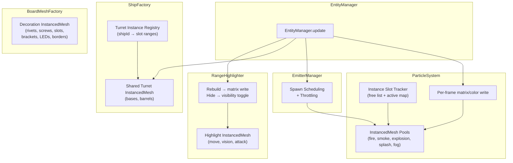

# Design Document: Rogue Draw Call Optimization

## Overview

The Rogue mode 3D scene currently generates ~991 draw calls, causing frame times of ~101ms (~10 FPS). The root cause is four subsystems that create individual `THREE.Mesh` objects instead of using instanced rendering:

1. **ParticleSystem** — spawns individual meshes per fire/smoke/explosion/splash particle
2. **ShipFactory.addTurrets** — creates individual `THREE.Mesh` per turret base and barrel
3. **BoardMeshFactory** — creates individual meshes for rivets (32), screws (4+slots), brackets (4), LEDs (4), borders (4)
4. **RangeHighlighter** — creates individual plane meshes per highlighted cell (up to 400 per type on 20×20)

The optimization strategy replaces all four bottlenecks with pre-allocated `THREE.InstancedMesh` pools. Each pool renders many copies of the same geometry in a single draw call using per-instance transformation matrices. Expired or unused instances are hidden by zeroing their scale rather than adding/removing scene graph nodes.

Target: total scene draw calls < 100, frame time < 33ms (≥30 FPS).

## Architecture

The optimization introduces an instanced rendering layer between the existing subsystems and the Three.js scene graph. Each subsystem manages its own `InstancedMesh` pools internally, keeping the public API surface unchanged.



### Key Design Decisions

1. **Pre-allocated pools over dynamic resizing**: Each `InstancedMesh` is allocated once at initialization with a fixed capacity. This avoids GPU buffer reallocation during gameplay. Overflow is handled by recycling the oldest instance (particles) or capping at the board maximum (highlights).

2. **Zero-scale hiding over scene removal**: Setting an instance's matrix to a zero-scale matrix effectively hides it without modifying the scene graph. This is cheaper than `group.add()`/`group.remove()` which trigger Three.js internal bookkeeping.

3. **Shared materials allocated once**: All materials are created during initialization and reused. The current `ParticleSystem.spawnSmoke()` clones materials per particle — this is eliminated.

4. **Turret pools owned by a new TurretInstanceManager**: Rather than embedding turret instancing inside `ShipFactory.addTurrets()`, a dedicated manager holds the shared `InstancedMesh` pools and maps ship IDs to instance slot ranges. `ShipFactory` calls into this manager instead of creating individual meshes.

5. **EmitterManager throttling**: When active emitter count exceeds a threshold (8), spawn intervals are scaled proportionally to keep total particle count within budget.


## Components and Interfaces

### 1. ParticleSystem (Modified)

**File**: `src/presentation/3d/entities/ParticleSystem.ts`

The `Particle` interface changes from holding a `THREE.Mesh` reference to holding an instance slot index:

```typescript
interface InstancedParticle {
    poolType: 'fire' | 'smoke' | 'explosion' | 'splash' | 'fog';
    slotIndex: number;
    position: THREE.Vector3;
    velocity: THREE.Vector3;
    rotation: THREE.Euler;
    scale: number;
    opacity: number;
    life: number;
    maxLife: number;
    group: THREE.Object3D;  // retained for world-space offset
}
```

New internal structure:

```typescript
interface InstancePool {
    mesh: THREE.InstancedMesh;
    capacity: number;
    activeCount: number;
    freeSlots: number[];          // stack of available slot indices
    slotToParticleIndex: Map<number, number>;  // slot → particles[] index
}
```

**Public API** (unchanged signatures, changed internals):
- `spawnFire(x, y, z, group, intensity)` — assigns a slot from the fire pool
- `spawnSmoke(x, y, z, color, group, intensity)` — assigns a slot from the smoke pool; uses shared material (no `.clone()`)
- `spawnExplosion(x, y, z, group)` — assigns slots from the explosion pool
- `spawnSplash(x, y, z, group)` — assigns slots from the splash pool
- `spawnFog(x, y, z, group)` — assigns a slot from the fog pool (replaces per-cell fog InstancedMesh creation in FogManager)
- `update()` — writes all active instance matrices and colors per frame, sets `needsUpdate`
- `clear()` — zeros all instance matrices, resets free lists
- `dispose()` — disposes all `InstancedMesh` geometries and materials

**New internal methods**:
- `private allocateSlot(pool: InstancePool): number` — pops from free list or recycles oldest
- `private releaseSlot(pool: InstancePool, slot: number): void` — zeros matrix, pushes to free list
- `private initPools(parentGroup: THREE.Object3D): void` — creates 5 `InstancedMesh` objects

**Pool capacities** (configurable):
| Pool | Capacity | Rationale |
|------|----------|-----------|
| Fire | 256 | ~8 emitters × 32 concurrent fire particles |
| Smoke | 384 | ~8 emitters × 48 concurrent smoke particles (longer life) |
| Explosion | 128 | Burst events, short-lived, doubled for headroom |
| Splash | 128 | Burst events, short-lived, doubled for headroom |
| Fog | 512 | Fog-of-war voxel particles for Rogue mode (replaces per-cell fog meshes) |


### 2. TurretInstanceManager (New)

**File**: `src/presentation/3d/entities/TurretInstanceManager.ts`

A new class that owns the shared turret `InstancedMesh` pools. One instance per board side (player/enemy), but in Rogue mode only one board exists.

```typescript
class TurretInstanceManager {
    private baseMesh: THREE.InstancedMesh;
    private barrelMesh: THREE.InstancedMesh;
    private shipSlots: Map<string, { baseSlots: number[]; barrelSlots: number[] }>;
    private nextSlot: number;
    private capacity: number;

    constructor(parentGroup: THREE.Object3D, capacity: number, isPlayer: boolean);
    addTurrets(shipId: string, turretTransforms: TurretTransform[]): void;
    removeTurrets(shipId: string): void;
    updateTransform(shipId: string, shipWorldMatrix: THREE.Matrix4): void;
    dispose(): void;
}

interface TurretTransform {
    localPosition: THREE.Vector3;   // position relative to ship origin
    barrelOffset: THREE.Vector3;    // barrel offset relative to turret base
    barrelRotation: THREE.Euler;    // barrel rotation
}
```

**Capacity**: 64 turret instances (covers ~20 ships × 3 turrets max).

**Integration with ShipFactory**: `ShipFactory.addTurrets()` is refactored to compute `TurretTransform[]` and call `TurretInstanceManager.addTurrets()` instead of creating individual meshes.

**Integration with EntityManager**: During `update()`, for any sinking ship, `EntityManager` calls `turretManager.updateTransform(shipId, shipWorldMatrix)` to keep turrets following the ship's sinking animation.

### 3. BoardMeshFactory (Modified)

**File**: `src/presentation/3d/entities/BoardMeshFactory.ts`

The `build()` method is refactored to create `InstancedMesh` objects instead of individual meshes:

| Decoration | Current | After | Draw Calls |
|-----------|---------|-------|------------|
| Rivets | 32 × `THREE.Mesh` | 1 × `InstancedMesh(32)` | 1 |
| Screw heads | 4 × `THREE.Mesh` | 1 × `InstancedMesh(4)` | 1 |
| Screw slots | 4 × `THREE.Mesh` | 1 × `InstancedMesh(4)` | 1 |
| Brackets | 4 × `THREE.Mesh` | 1 × `InstancedMesh(4)` | 1 |
| LEDs | 4 × `THREE.Mesh` | 1 × `InstancedMesh(4)` | 1 |
| Borders | 4 × `THREE.Mesh` | 1 × `InstancedMesh(4)` | 1 |
| Base | 1 × `THREE.Mesh` | 1 × `THREE.Mesh` (unchanged) | 1 |
| Bottom plane | 1 × `THREE.Mesh` | 1 × `THREE.Mesh` (unchanged) | 1 |

**Total**: 8 draw calls (down from ~52).

The return type is extended to include the LED `InstancedMesh` reference so `EntityManager.updateStaticAnimations()` can update LED opacity via instance colors instead of per-mesh material mutation:

```typescript
interface BoardMeshBuildResult {
    frameMat: THREE.MeshStandardMaterial;
    rivetMat: THREE.MeshStandardMaterial;
    screwMat: THREE.MeshStandardMaterial;
    ledMesh: THREE.InstancedMesh;       // new: for LED pulse animation
    ledPhases: number[];                 // new: per-LED animation phase offsets
}
```


### 4. RangeHighlighter (Modified)

**File**: `src/presentation/3d/interaction/RangeHighlighter.ts`

Replace the three `THREE.Group` containers (which hold individual plane meshes) with three pre-allocated `InstancedMesh` objects. The groups are retained only as parents for scene graph attachment.

```typescript
class RangeHighlighter {
    // Existing group references retained for scene attachment
    public moveHighlightGroup: THREE.Group;
    public visionHighlightGroup: THREE.Group;
    public attackHighlightGroup: THREE.Group;

    // New: pre-allocated instanced meshes
    private moveInstancedMesh: THREE.InstancedMesh;
    private visionInstancedMesh: THREE.InstancedMesh;
    private attackInstancedMesh: THREE.InstancedMesh;

    private static readonly MAX_CELLS = 400; // 20×20 board max
    private readonly zeroMatrix: THREE.Matrix4;  // cached zero-scale matrix
}
```

**Changed methods**:
- `rebuildMoveHighlight(ship, board)` — computes cell positions, writes instance matrices for valid cells, zeros remaining slots. No mesh creation/disposal.
- `rebuildRangeHighlights(ship, board)` — same pattern for vision and attack pools.
- `hideAll()` — sets `visible = false` on each `InstancedMesh` (no disposal).
- `disposeGroupChildren()` — removed entirely (no longer needed).

**New method**:
- `dispose()` — disposes the three `InstancedMesh` geometries and materials (called on full cleanup only).

**Draw calls**: 3 total (down from up to 1200 on a 20×20 board).

### 5. EmitterManager (Modified)

**File**: `src/presentation/3d/entities/EmitterManager.ts`

Added throttling logic to `updateEmitters()`:

```typescript
class EmitterManager {
    private static readonly EMITTER_THROTTLE_THRESHOLD = 8;
    private static readonly MAX_ACTIVE_EMITTERS = 24;

    public updateEmitters(spawner: EmitterSpawnCallback): void {
        const activeCount = this.emitters.length;
        const throttleFactor = activeCount > EmitterManager.EMITTER_THROTTLE_THRESHOLD
            ? EmitterManager.EMITTER_THROTTLE_THRESHOLD / activeCount
            : 1.0;

        // Apply throttleFactor to spawn interval calculation
        // ...existing scheduling logic with adjusted intervals...
    }
}
```

When `activeCount > 8`, spawn intervals are multiplied by `activeCount / 8`, effectively halving spawn rate at 16 emitters, thirding it at 24, etc.

The `MAX_ACTIVE_EMITTERS` cap prevents `addEmitter()` from registering beyond 24 emitters. Excess emitters are silently dropped (lowest intensity first if priority is added later).

### 6. EntityManager (Modified)

**File**: `src/presentation/3d/entities/EntityManager.ts`

Changes:
- Holds a `TurretInstanceManager` reference, created during construction
- Passes `TurretInstanceManager` to `ShipFactory.createShip()` calls
- In `update()`, iterates sinking ships and calls `turretManager.updateTransform()`
- In `resetMatch()`, calls `turretManager.dispose()` and recreates it
- `updateStaticAnimations()` updated to animate LED instance colors via the `ledMesh` reference from `BoardMeshFactory` instead of iterating `staticGroup.children`
- Adds draw call budget enforcement: if `renderer.info.render.calls > 100`, signals `ParticleSystem` to reduce spawn rates


## Data Models

### Instance Slot Tracking

Each `InstancedMesh` pool uses a free-list allocator to manage instance slots:

```typescript
interface InstancePool {
    mesh: THREE.InstancedMesh;
    capacity: number;
    activeCount: number;
    freeSlots: number[];                        // stack — O(1) alloc/free
    slotToParticleIndex: Map<number, number>;   // maps slot → particles array index
}
```

**Allocation**: `freeSlots.pop()` returns the next available slot. If empty, the oldest active particle is recycled (evicted and its slot reused).

**Deallocation**: The instance matrix at the slot is set to the zero-scale matrix, and the slot index is pushed back onto `freeSlots`.

### Particle Instance Data

Replaces the current `Particle` interface (which holds a `THREE.Mesh` reference):

```typescript
interface InstancedParticle {
    poolType: 'fire' | 'smoke' | 'explosion' | 'splash' | 'fog';
    slotIndex: number;
    position: THREE.Vector3;
    velocity: THREE.Vector3;
    rotation: THREE.Euler;
    scale: number;
    opacity: number;
    life: number;
    maxLife: number;
    group: THREE.Object3D;
}
```

The `group` field is retained to compute world-space offsets (particles are spawned relative to board groups that may have transforms applied).

### Turret Instance Registry

Maps ship IDs to their allocated turret instance slots:

```typescript
// Inside TurretInstanceManager
private shipSlots: Map<string, {
    baseSlots: number[];    // indices into baseMesh
    barrelSlots: number[];  // indices into barrelMesh
}>;
```

When a ship is removed or sinks, its slots are zeroed and returned to the free pool.

### Draw Call Budget

```typescript
interface DrawCallBudget {
    target: number;          // 100
    current: number;         // read from renderer.info.render.calls
    particleSpawnScale: number;  // 0.0–1.0, reduced when over budget
}
```

`EntityManager` reads `renderer.info.render.calls` each frame and adjusts `particleSpawnScale` which is passed to `ParticleSystem` to throttle spawn counts proportionally.

### Configuration Constants

Added to the particle/emitter system (not to `Config.ts` to keep presentation concerns out of infrastructure):

```typescript
const PARTICLE_POOL_CONFIG = {
    fire: { capacity: 256, geometry: new THREE.BoxGeometry(0.12, 0.12, 0.12) },
    smoke: { capacity: 384, geometry: new THREE.BoxGeometry(0.12, 0.12, 0.12) },
    explosion: { capacity: 128, geometry: new THREE.BoxGeometry(0.15, 0.15, 0.15) },
    splash: { capacity: 128, geometry: new THREE.BoxGeometry(0.15, 0.15, 0.15) },
    fog: { capacity: 512, geometry: new THREE.BoxGeometry(0.15, 0.15, 0.15) },
};

const TURRET_POOL_CONFIG = {
    capacity: 64,
    baseGeometry: new THREE.BoxGeometry(0.15, 0.08, 0.15),
    barrelGeometry: new THREE.CylinderGeometry(0.025, 0.025, 0.2, 6),
};

const EMITTER_CONFIG = {
    throttleThreshold: 8,
    maxActiveEmitters: 24,
};

const DRAW_CALL_BUDGET = {
    target: 100,
};
```


## Correctness Properties

*A property is a characteristic or behavior that should hold true across all valid executions of a system — essentially, a formal statement about what the system should do. Properties serve as the bridge between human-readable specifications and machine-verifiable correctness guarantees.*

### Property 1: Single InstancedMesh per particle type

*For any* number of spawned particles across fire, smoke, explosion, splash, and fog types, the ParticleSystem shall contain exactly 5 InstancedMesh objects (one per type), and no individual THREE.Mesh children shall be added to any parent group.

**Validates: Requirements 1.1, 1.2, 1.3, 1.11**

### Property 2: No material or mesh allocation on spawn

*For any* sequence of particle spawn calls (spawnFire, spawnSmoke, spawnExplosion, spawnSplash), the total number of THREE.Material instances and THREE.Mesh instances in the system shall remain constant (equal to the count established at initialization).

**Validates: Requirements 1.4, 1.10, 8.4**

### Property 3: Particle pool capacity invariant

*For any* sequence of spawn calls to a single particle pool, the number of active instances in that pool shall never exceed the pool's pre-allocated capacity. When a spawn is requested and the pool is full, the oldest active particle shall be evicted and its slot reused.

**Validates: Requirements 1.7, 5.3**

### Property 4: Per-frame buffer update flag

*For any* set of active particles, after calling `update()`, the `instanceMatrix.needsUpdate` flag shall be `true` on every InstancedMesh pool that has at least one active instance, and `instanceColor.needsUpdate` shall be `true` on pools that support per-instance color (smoke, splash).

**Validates: Requirements 1.8, 1.9, 6.7**

### Property 5: Zero-scale hiding on expiry

*For any* particle that reaches `life <= 0`, after the next `update()` call, the instance matrix at that particle's slot index shall have zero scale, and the slot shall be returned to the free list (available for reuse).

**Validates: Requirements 1.5**

### Property 6: Particle physics invariants preserved

*For any* active particle after N update steps:
- Fire particles shall have net upward velocity (velocity.y > 0) and decreasing scale over time
- Smoke particles shall have increasing scale over time and decreasing opacity (opacity at step N+1 ≤ opacity at step N)
- Explosion/splash particles shall have decreasing velocity.y over time (gravity applied)

**Validates: Requirements 6.1, 6.2, 6.3**

### Property 7: Turret instancing uses exactly 2 InstancedMesh objects

*For any* number of ships added to a board (0 to 20), the TurretInstanceManager shall contain exactly 2 InstancedMesh objects (one for bases, one for barrels), and no individual turret THREE.Mesh objects shall exist in any ship group.

**Validates: Requirements 2.1, 2.2, 2.5**

### Property 8: Turret add/remove round trip

*For any* ship added to the board and subsequently removed, the turret instance active count shall return to its value before the ship was added, and the removed ship's turret slots shall have zero-scale matrices.

**Validates: Requirements 2.3, 2.4**

### Property 9: Sinking turrets follow ship transform

*For any* sinking ship with a non-identity world matrix, after `updateTransform()` is called, the turret instance matrices for that ship shall incorporate the ship's current world-space position and rotation.

**Validates: Requirements 2.6**

### Property 10: Highlight instancing uses exactly 3 InstancedMesh objects

*For any* rebuild of range highlights with N highlighted cells (0 ≤ N ≤ 400), the RangeHighlighter shall contain exactly 3 InstancedMesh objects (move, vision, attack), and no individual plane THREE.Mesh children shall exist in the highlight groups.

**Validates: Requirements 4.1, 4.2, 4.3, 4.7**

### Property 11: Highlight rebuild writes correct instance count

*For any* rebuild with N valid cells for a highlight type out of capacity C, exactly N instance slots shall have valid (non-zero-scale) transforms and C − N slots shall have zero-scale matrices.

**Validates: Requirements 4.4**

### Property 12: Highlight hide preserves meshes

*For any* call to `hideAll()`, the InstancedMesh objects shall still exist (not disposed) with `visible === false`, and a subsequent rebuild shall be able to reuse them without reallocation.

**Validates: Requirements 4.5**

### Property 13: Emitter throttling scales spawn interval

*For any* emitter count exceeding the throttle threshold (8), the effective spawn interval shall be multiplied by `emitterCount / threshold`, resulting in proportionally fewer spawns per frame as emitter count grows. The total active emitter count shall never exceed the global maximum (24).

**Validates: Requirements 7.1, 7.2, 7.4**

### Property 14: Draw call budget enforcement

*For any* frame where `renderer.info.render.calls` exceeds 100, the ParticleSystem's spawn rate scale factor shall be reduced below 1.0 proportionally, and shall return to 1.0 when draw calls fall back below the target.

**Validates: Requirements 5.4**

### Property 15: Clear resets all pool state

*For any* state of the ParticleSystem (with N active particles across all pools), after calling `clear()`, every instance matrix in every pool shall have zero scale, `activeCount` shall be 0 for all pools, and `freeSlots.length` shall equal `capacity` for all pools.

**Validates: Requirements 8.1**

### Property 16: Dispose releases all GPU resources

*For any* state of the ParticleSystem, after calling `dispose()`, all InstancedMesh geometries and materials shall have been disposed (geometry.dispose() and material.dispose() called).

**Validates: Requirements 8.3**

### Property 17: Board decoration theme reactivity

*For any* theme change event, the shared materials on all board decoration InstancedMesh objects shall have their color properties updated to match the new theme values from ThemeManager.

**Validates: Requirements 3.7**


## Error Handling

### Pool Overflow

When a particle pool is full and a new spawn is requested, the system recycles the oldest active particle rather than failing or growing the buffer. This is a graceful degradation — the visual effect is slightly reduced (oldest particle disappears early) but no error occurs and no GPU reallocation is needed.

### Turret Slot Exhaustion

If `TurretInstanceManager` runs out of slots (more than 64 turrets), additional turrets are silently skipped. This should never occur in practice (20 ships × 3 turrets = 60 max), but the guard prevents buffer overrun.

### Invalid Ship ID on Remove

If `TurretInstanceManager.removeTurrets()` is called with an unknown ship ID, the call is a no-op. This handles edge cases where a ship was never added (e.g., special types like mines/sonar buoys that don't have turrets).

### Dispose Safety

All `dispose()` methods are idempotent — calling dispose twice does not throw. Geometry and material disposal calls are guarded against already-disposed state.

### Draw Call Budget Overshoot

If draw calls exceed 100 despite throttling, the system continues to reduce particle spawn rates down to a floor of 0.1× (never fully stops spawning). This ensures some visual feedback is always present even under extreme load.

### InstancedMesh Color Buffer Initialization

`THREE.InstancedMesh` does not create an `instanceColor` buffer by default. The system calls `setColorAt(0, white)` during initialization to force buffer creation, then zeros it. This prevents null reference errors when updating colors during the first frame.

## Testing Strategy

### Property-Based Testing

Property-based tests use **fast-check** (the standard PBT library for TypeScript/JavaScript). Each property test runs a minimum of 100 iterations with randomly generated inputs.

Each test is tagged with a comment referencing its design property:
```typescript
// Feature: rogue-draw-call-optimization, Property 1: Single InstancedMesh per particle type
```

**Property tests to implement:**

| Property | Test Description | Generator Strategy |
|----------|-----------------|-------------------|
| 1 | Spawn random counts of each particle type, verify 5 InstancedMesh objects and 0 individual meshes | `fc.record({ fire: fc.nat(50), smoke: fc.nat(50), explosion: fc.nat(20), splash: fc.nat(20), fog: fc.nat(50) })` |
| 2 | Spawn random particle sequences, count material instances before/after | `fc.array(fc.oneof(fc.constant('fire'), fc.constant('smoke'), fc.constant('explosion'), fc.constant('splash'), fc.constant('fog')), { maxLength: 100 })` |
| 3 | Spawn more particles than pool capacity, verify active count ≤ capacity and oldest evicted | `fc.nat({ max: 300 })` for spawn count per type |
| 4 | Spawn particles then call update(), verify needsUpdate flags | `fc.record(...)` of spawn counts |
| 5 | Spawn particles, advance time until expiry, verify zero-scale and free list | `fc.nat(50)` for spawn count, `fc.nat(200)` for update steps |
| 6 | Spawn each particle type, run N updates, verify physics invariants | `fc.nat({ min: 1, max: 100 })` for update count |
| 7 | Add random number of ships (0–20), verify exactly 2 turret InstancedMesh objects | `fc.nat({ max: 20 })` for ship count |
| 8 | Add then remove random ships, verify active count returns to original | `fc.array(fc.record({ size: fc.integer({ min: 2, max: 5 }) }))` |
| 9 | Set random sinking transforms, verify turret matrices incorporate ship matrix | `fc.record({ y: fc.float({ min: -3, max: 0 }), rotZ: fc.float({ min: 0, max: 0.25 }) })` |
| 10 | Rebuild highlights with random cell counts, verify 3 InstancedMesh objects | `fc.nat({ max: 400 })` for cell count |
| 11 | Rebuild with N cells, verify N valid + (C-N) zero-scale matrices | `fc.nat({ max: 400 })` |
| 12 | Rebuild then hideAll(), verify meshes exist with visible=false, then rebuild again | `fc.nat({ max: 400 })` |
| 13 | Create random emitter counts (1–30), verify spawn interval scaling | `fc.integer({ min: 1, max: 30 })` |
| 14 | Simulate draw call counts above/below 100, verify spawn rate adjustment | `fc.integer({ min: 50, max: 200 })` |
| 15 | Spawn random particles, call clear(), verify all pools reset | `fc.record(...)` of spawn counts |
| 16 | Spawn random particles, call dispose(), verify all geometries/materials disposed | `fc.record(...)` |
| 17 | Trigger theme change, verify material colors match ThemeManager | Theme color generators |

### Unit Tests

Unit tests cover specific examples and edge cases not suited to property-based testing:

- **Board decoration counts** (Req 3.1–3.6, 3.8): Verify exact instance counts after `BoardMeshFactory.build()` — 32 rivets, 4 screws, 4 screw slots, 4 brackets, 4 LEDs, 4 borders = 8 draw calls total
- **Highlight capacity** (Req 4.6): Verify each highlight InstancedMesh has capacity ≥ 400
- **Pool capacity values** (Req 1.6): Verify fire=256, smoke=384, explosion=128, splash=128, fog=512
- **Draw call integration** (Req 5.1): Set up scene with 12 ships + active effects, verify `renderer.info.render.calls < 100`
- **Turret visual fidelity** (Req 6.4): Verify turret base geometry is `BoxGeometry(0.15, 0.08, 0.15)` and barrel is `CylinderGeometry(0.025, 0.025, 0.2, 6)`
- **Highlight visual fidelity** (Req 6.5, 6.6): Verify material colors (move=0x00ffff, vision=0x4169E1, attack=0xFFA500), opacity, and depthWrite settings
- **Turret disposal on reset** (Req 8.2): Verify old turret meshes are disposed and new ones created after `resetMatch()`
- **Empty pool edge case**: Verify spawning into an empty pool works correctly on first use
- **Zero active particles**: Verify `update()` with no active particles doesn't throw or set needsUpdate unnecessarily

### Test File Organization

```
src/presentation/3d/entities/__tests__/
    ParticleSystem.instancing.test.ts      — Properties 1–6, 14–16
    TurretInstanceManager.test.ts          — Properties 7–9
    BoardMeshFactory.instancing.test.ts    — Property 17, unit tests for decoration counts
    RangeHighlighter.instancing.test.ts    — Properties 10–12
    EmitterManager.throttling.test.ts      — Property 13
```

### Mocking Strategy

All tests mock `THREE.InstancedMesh`, `THREE.BoxGeometry`, `THREE.CylinderGeometry`, and `THREE.MeshStandardMaterial` to avoid WebGL context requirements. Mocks track:
- `setMatrixAt()` calls and their arguments
- `setColorAt()` calls and their arguments
- `dispose()` calls
- `instanceMatrix.needsUpdate` and `instanceColor.needsUpdate` flag reads
- Constructor call counts (to verify no new materials/meshes are created during gameplay)

