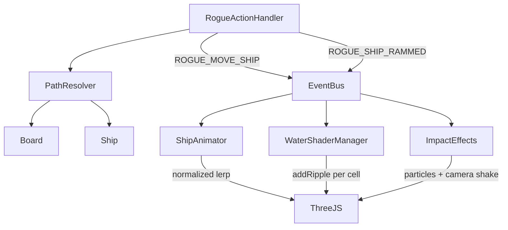

# Design Document: Rogue Movement & Collision

## Overview

This design overhauls Rogue mode's movement pipeline to support doubled movement range, per-cell path evaluation (mines, fog, collisions), impassable entities, ramming mechanics, and polished movement animations (normalized timing, water ripples, impact effects).

The core change is replacing the current single-hop `moveShip` call with a `PathResolver` that walks each cell sequentially, checking for mines, collisions, and fog at every step. The presentation layer gets normalized animation timing and ripple/impact effects.

## Architecture



**Key decisions:**
- `PathResolver` lives in `domain/board/` — pure logic, no framework deps
- `Ship.maxMoves` changes from `readonly` to a getter reading a mutable backing field, so the doubled formula applies without breaking the constructor pattern
- Ramming is resolved inside `PathResolver` as a path-termination event, not a separate system
- Animation normalization happens in `ShipAnimator` by dividing total duration by cell count

## Components and Interfaces

### 1. PathResolver (NEW — `src/domain/board/PathResolver.ts`)

Pure domain class. Computes cell-by-cell paths and resolves collisions/mines.

```typescript
export interface PathCell {
  x: number;
  z: number;
}

export interface PathResult {
  /** Cells the ship actually traverses (may be shorter than requested) */
  path: PathCell[];
  /** Final head position */
  finalX: number;
  finalZ: number;
  /** If movement was stopped by a mine */
  hitMine: boolean;
  mineX?: number;
  mineZ?: number;
  /** If movement was stopped by ramming another ship */
  rammed: boolean;
  rammedShip?: Ship;
  /** The cell where collision occurred (the blocked cell itself) */
  collisionCell?: PathCell;
}

export class PathResolver {
  /**
   * Computes the ordered path from ship's current position to (targetX, targetZ).
   * Walks cell-by-cell, checking each for:
   *   1. Out-of-bounds → stop at last valid cell
   *   2. Impassable entity (ship, dead ship, Sunk cell) → ramming or stop
   *   3. Mine → detonate, stop
   * Does NOT mutate board state — caller applies results.
   */
  public resolve(
    board: Board,
    ship: Ship,
    targetX: number,
    targetZ: number,
    newOrientation: Orientation
  ): PathResult;

  /**
   * Returns ordered intermediate cells between two points.
   * Uses axis-aligned stepping: primary axis first, then secondary.
   */
  public computeCellPath(
    fromX: number, fromZ: number,
    toX: number, toZ: number
  ): PathCell[];

  /**
   * Checks if a cell is impassable (occupied by any ship, or CellState.Sunk).
   * Ignores the moving ship's own cells.
   */
  public isCellBlocked(
    board: Board,
    x: number, z: number,
    movingShip: Ship
  ): { blocked: boolean; blockingShip?: Ship };
}
```

**Path algorithm:** Step along the primary movement axis (larger delta) first, then the secondary axis. For each cell, check all segments of the ship at that position (not just the head). If any segment overlaps a blocked cell, stop.

### 2. Ship.maxMoves change (`src/domain/fleet/Ship.ts`)

```typescript
// Before: public readonly maxMoves: number;
// After:
private _maxMoves: number;
public get maxMoves(): number { return this._maxMoves; }
public set maxMoves(value: number) { this._maxMoves = value; }

// Constructor:
this._maxMoves = Math.max(0, 5 - this.size) * 2;
```

### 3. RogueActionHandler changes (`src/application/game-loop/RogueActionHandler.ts`)

- Replace direct `sharedBoard.moveShip()` with `PathResolver.resolve()` + apply results
- On ramming: inflict damage, rotate rammer 90°, set movesRemaining=0, emit `ROGUE_SHIP_RAMMED`
- On mine hit: apply damage via existing mine logic, stop ship
- Guard: reject moves on dead/static entities before calling PathResolver

### 4. GameEventBus additions (`src/application/events/GameEventBus.ts`)

```typescript
// New event types:
ROGUE_SHIP_RAMMED = 'ROGUE_SHIP_RAMMED',
ROGUE_PATH_MOVE = 'ROGUE_PATH_MOVE',

// New payloads:
[GameEventType.ROGUE_SHIP_RAMMED]: {
  rammerShipId: string;
  rammedShipId: string;
  contactX: number;
  contactZ: number;
  rammerNewOrientation: Orientation;
};
[GameEventType.ROGUE_PATH_MOVE]: {
  shipId: string;
  path: PathCell[];
  finalOrientation: Orientation;
  animationDurationMs: number;
};
```

### 5. ShipAnimator changes (`src/presentation/3d/entities/ShipAnimator.ts`)

- New method: `animateAlongPath(shipGroup, path, orientation, durationMs)` — lerps through waypoints with fixed total duration
- Rotation blending: slerp between orientations over the same duration
- Replaces the current single-target lerp for rogue movement

### 6. Water ripple integration

On `ROGUE_PATH_MOVE`, schedule `WaterShaderManager.addRipple()` calls evenly spaced across the animation duration — one per path cell.

### 7. Ramming visual effects

On `ROGUE_SHIP_RAMMED`:
- `ImpactEffects` spawns a collision particle burst at the contact point (reuse `spawnExplosion` with reduced intensity)
- Camera shake via a short-duration sinusoidal offset on `Engine3D`'s camera position

### 8. Static/Dead entity immobility

Guard in `RogueActionHandler.handleAttemptMove` and `AIMovement.computeMove`:
```typescript
if (ship.isSunk() || ship.isSpecialWeapon) return; // skip
```

## Data Models

### PathResult (described above in PathResolver interface)

### Config additions

```typescript
// Config.timing additions:
timing: {
  ...existing,
  rogueMoveDurationMs: 600,    // fixed duration for all movement animations
  rogueTurnDurationMs: 400,    // fixed duration for rotation animations
}
```

### Ship state changes

| Field | Before | After |
|-------|--------|-------|
| `maxMoves` | `readonly`, `Math.max(0, 5-size)` | getter/setter, `Math.max(0, 5-size) * 2` |
| `movesRemaining` | set in `resetTurnAction` | unchanged behavior, reads new `maxMoves` |

### Board state — no schema changes

`CellState` enum unchanged. `Sunk` cells are now explicitly treated as impassable by `PathResolver.isCellBlocked`.


## Correctness Properties

*A property is a characteristic or behavior that should hold true across all valid executions of a system — essentially, a formal statement about what the system should do. Properties serve as the bridge between human-readable specifications and machine-verifiable correctness guarantees.*

### Property 1: Path stays within bounds

*For any* board of dimensions W×H and any ship with any start position and target position, every cell in the resolved path shall have coordinates `0 <= x < W` and `0 <= z < H`.

**Validates: Requirements 1.5**

### Property 2: maxMoves doubled formula and reset

*For any* ship with size in [1..5], `maxMoves` shall equal `Math.max(0, 5 - size) * 2`, and after calling `resetTurnAction()`, `movesRemaining` shall equal `maxMoves`.

**Validates: Requirements 2.1, 2.2**

### Property 3: Move cost ratios preserved

*For any* ship orientation and any target cell, `calculateMoveCost` shall return `distance * 0.5` for forward movement, `distance * 1.0` for lateral movement, and `distance * 2.0` for backward movement.

**Validates: Requirements 2.3**

### Property 4: Path adjacency and ordering

*For any* start cell A and target cell B, the computed cell path shall be an ordered sequence where each consecutive pair of cells differs by exactly 1 in either x or z (never both), the first cell is adjacent to A, and the last cell is B (or the stop point).

**Validates: Requirements 3.1**

### Property 5: Mine detonation stops ship and applies damage

*For any* board with one or more mines along a ship's path, the resolved path shall terminate at the first mine cell encountered, the mine entity shall have its segment hit, and the ship shall have its corresponding segment hit.

**Validates: Requirements 3.2, 3.3**

### Property 6: Impassable cells block path

*For any* board containing ships (alive or sunk) or cells in `CellState.Sunk` along a movement path, the resolved path shall stop at the last unoccupied cell before the first impassable cell. If the first cell is impassable, the path shall be empty and the ship remains at its original position.

**Validates: Requirements 4.1, 4.2, 4.3, 4.4**

### Property 7: Static and dead entity immobility

*For any* entity where `isSpecialWeapon === true` or `isSunk() === true`, any attempt to resolve a move shall be rejected (empty path, no state change).

**Validates: Requirements 5.1, 5.2**

### Property 8: Ramming inflicts damage to both ships

*For any* path that intersects a cell occupied by another ship, the `PathResult` shall have `rammed === true`, the ramming ship's front segment (index 0) shall be marked as hit, and the rammed ship's nearest segment to the collision point shall be marked as hit.

**Validates: Requirements 6.1, 6.2, 6.3**

### Property 9: Ramming rotates the rammer 90 degrees

*For any* ramming event, the ramming ship's final orientation shall be a 90-degree rotation from its pre-move orientation (Horizontal↔Vertical, Left↔Up).

**Validates: Requirements 6.4**

### Property 10: Ramming stops ship adjacent to target

*For any* ramming event, the ramming ship's final position shall be the last unoccupied cell in the path immediately before the collision cell, and this cell shall be adjacent to the rammed ship.

**Validates: Requirements 6.5**

### Property 11: Ramming exhausts movement

*For any* ramming event, after resolution the ramming ship shall have `movesRemaining === 0` and `hasActedThisTurn === true`.

**Validates: Requirements 6.6**

### Property 12: Ramming is team-agnostic

*For any* two ships where one rams the other, the resulting damage, rotation, and stopping behavior shall be identical regardless of whether the rammed ship has `isEnemy === true` or `isEnemy === false`.

**Validates: Requirements 6.7**

## Error Handling

| Scenario | Handler | Behavior |
|----------|---------|----------|
| Target cell out of bounds | `PathResolver.resolve` | Returns empty path, ship stays put |
| Ship already sunk | `RogueActionHandler` guard | Rejects move, skips to next ship |
| Ship is mine/sonar | `RogueActionHandler` guard | Rejects move, skips to next ship |
| Zero movesRemaining | `RogueActionHandler` guard | Rejects move (existing behavior) |
| Path fully blocked at cell 1 | `PathResolver.resolve` | Returns empty path, ship stays put |
| Mine detonation sinks the moving ship | `RogueActionHandler` | Applies sinking, decrements `aliveShipsCount`, emits existing sinking events |
| Ramming sinks either ship | `RogueActionHandler` | Applies sinking to the sunk ship, checks win condition |
| Animation for zero-length path | `ShipAnimator` | No-op, no animation queued |

## Testing Strategy

### Property-Based Testing

Library: **fast-check** (TypeScript-native, integrates with Vitest)

Each correctness property above maps to a single property-based test with minimum 100 iterations. Tests are co-located in `src/domain/board/__tests__/PathResolver.test.ts` and `src/domain/fleet/__tests__/Ship.movement.test.ts`.

Tag format per test:
```
// Feature: rogue-movement-collision, Property N: <title>
```

**Generators needed:**
- `arbitraryShip(sizeRange)` — random ship with size 1-5, random orientation, random valid position
- `arbitraryBoard(width, height, shipCount, mineCount)` — board with randomly placed ships and mines
- `arbitraryTarget(board)` — random valid target cell within board bounds

### Unit Tests

Focus on specific examples and edge cases:
- Ship size 5 → maxMoves = 0 (cannot move)
- Ship size 1 → maxMoves = 8 (maximum range)
- Mine at first cell of path → ship doesn't move, takes damage
- Ramming a size-1 ship that sinks from the ram
- Path through a corner (diagonal movement decomposed into axis-aligned steps)
- Config change mid-game updates maxMoves on next turn reset

### Test File Locations

| File | Covers |
|------|--------|
| `src/domain/board/__tests__/PathResolver.test.ts` | Properties 1, 4, 5, 6, 8, 9, 10 |
| `src/domain/fleet/Ship.test.ts` | Properties 2, 3 (extend existing file) |
| `src/application/game-loop/__tests__/RogueActionHandler.movement.test.ts` | Properties 7, 11, 12 |
