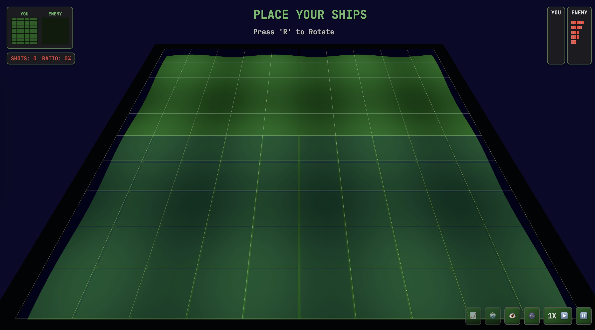

Please take a look at @game-concepts.md, @tech-breakdown.md and @tasks.md. We want to continue improving our game. We will make both visual, functional and maybe even some structural changes.

1. don't highlight cells that we've already shot at
2. fog should be much denser
3. attack projectile should come from the other side of the board, as if one of player ships has fired it
4. save and load menus should have the same effect as pause menu - game paused and not clickable
5. HUD elements should be 140% larger
6. zoom levels should be saved and restored on load, perserved in save
7. default zoom level should fill the bottom of the screen like on this screenshot:
