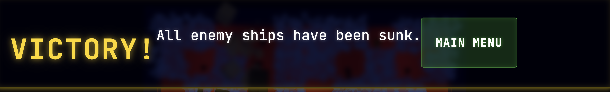

Please take a look at @game-concepts.md, @tech-breakdown.md and @tasks.md. We want to continue improving our game. We will make both visual, functional and maybe even some structural changes.

1. **Extended Shot Sequence:** The tactical board must wait for all post-shot animations—including projectile flight, impact effects, and voxel destruction—to fully conclude before flipping to the opponent's view.
2. **Camera Interactivity Guard:** To prevent accidental shots or UI misclicks, all interactive clicking on the battlefield should be strictly ignored while the player is actively rotating or zooming the camera.
3. **Restoration of Visual State:** After loading a saved game, the engine should replay all relevant shot and "sunk ship" animations. This ensures that environmental effects like smoke, fire, and destroyed ship voxels are correctly synchronized with the game's logical state.
4. **Procedural UI Sound Effects:** Add a unique "bubble popping" sound effect for every button on the UI. These should be procedurally generated at runtime, following the same logic used for shot/hit/miss sounds to maintain audio consistency.
6. **Victory Screen Modal:** The current victory banner is crooked and visually inconsistent. It should be redesigned as a proper, centralized pop-up screen (modal) with clear win/loss feedback.
   
7. **Bidirectional Grid Highlighting:** Hovering over a cell on the 3D battlefield should highlight its corresponding cell on the 2D minimap, and vice-versa. Both surfaces should be fully clickable for targeting.
8. **Universal UI Readability:** The color scheme needs a comprehensive adjustment to ensure that the HUD and all text elements remain highly legible in both light and dark (Day/Night) modes.
9. **HUD Damage Reflection:** The hit markers should be visually reflected on the appropriate ship silhouettes or elements within the HUD, providing immediate feedback on the fleet's status.
10. **Enhanced Geek Stats:** Incorporate the current camera zoom level into the "Geek Stats" overlay on the HUD to provide more technical detail during play.
11. **Standardized Default View:** The initial game view should be set to a top-down perspective, zoomed out sufficiently to see the entire board without any HUD elements overlapping the tactical grid.