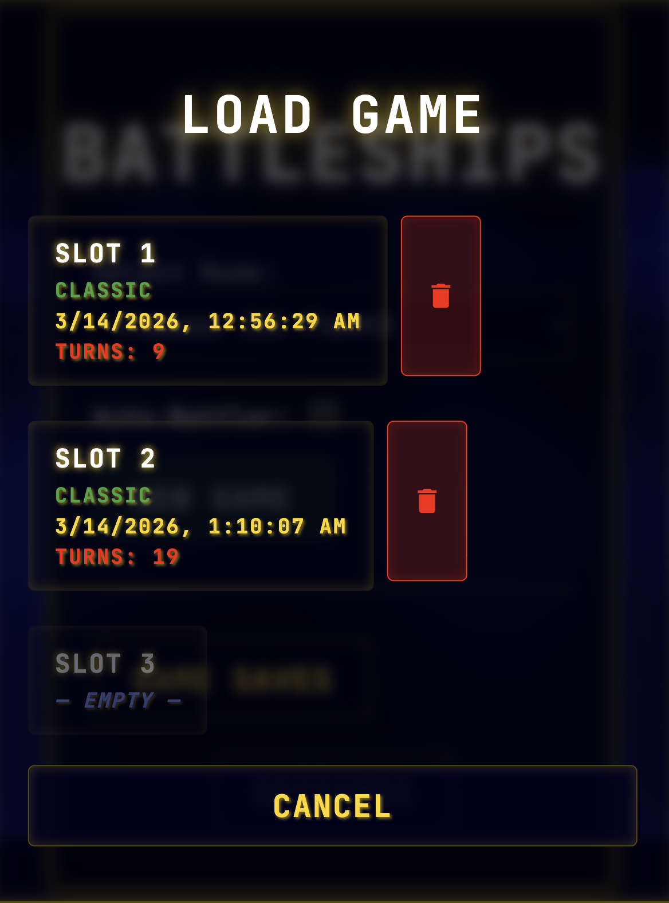
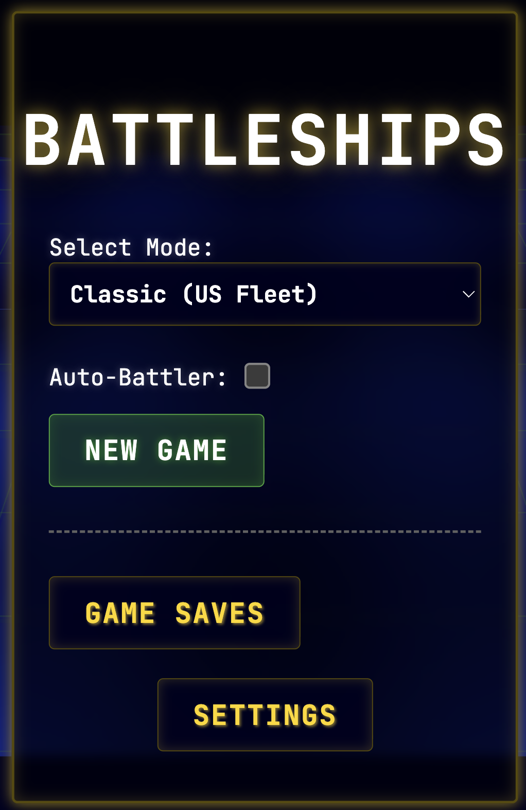

Please take a look at @game-concepts.md, @tech-breakdown.md and @tasks.md. We want to continue improving our game. We will make both visual, functional and maybe even some structural changes.

1. The board should wait for all animations after shot to complete before flipping.
2. While player is rotating the camera, clicks should be ignored.
3. After loading saved game, the board should replay all shot and sunk ships animations to restore visual state of the board.
4. We should add sound effect for every button on our UI. It should sound like a bubble popping. Generate the sound similarly to how we generate shot/hit/miss sounds. 
5. A couple of menus got crooked. Please fix main menu, load and save menus. Here are example screenshots:

6. Victory banner should be changed into a pop-up screen, right now it also looks crooked.

7. Hovering over the battlefield should highlight matching minimap cell and vice versa. Both should be clickable.