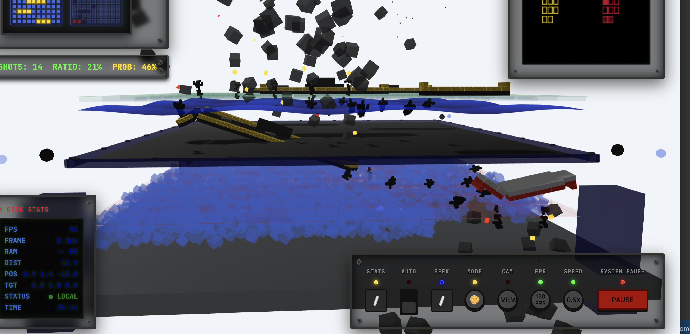
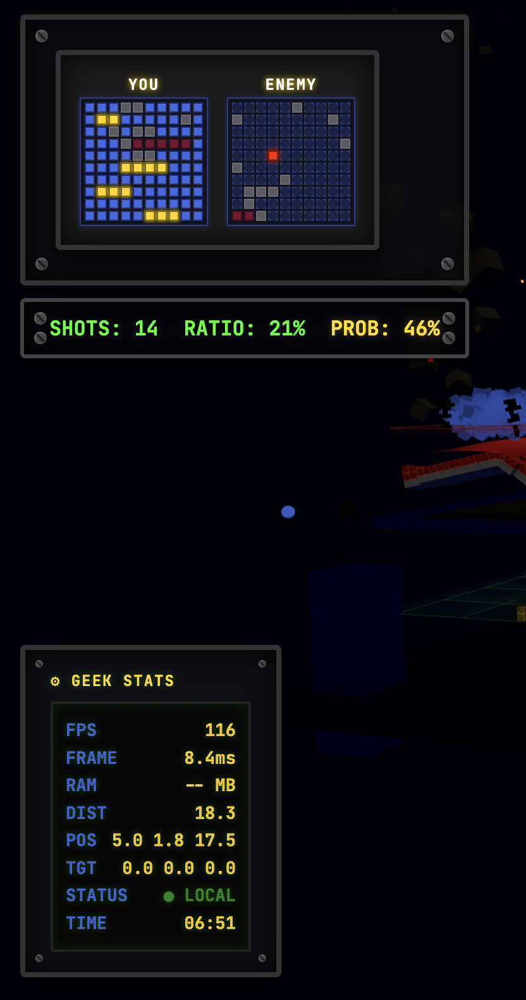
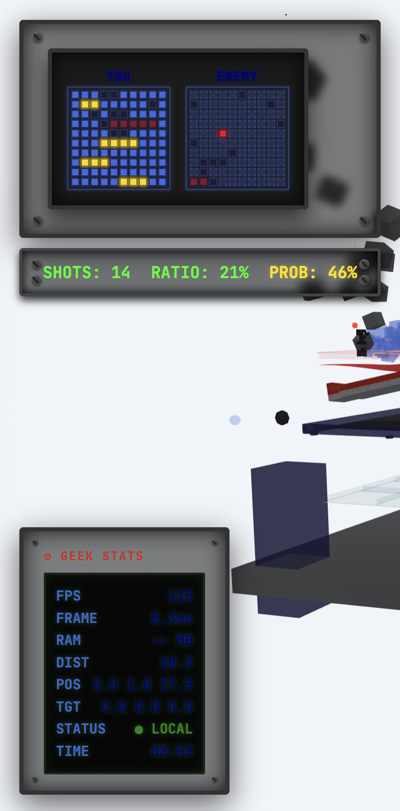

Please take a look at these documents that briefly describe different aspects of our implementation:
.kiro/steering/product.md
.kiro/steering/structure.md
.kiro/steering/tech.md
We want to continue improving our game. 
We will make both visual, functional and maybe even some structural changes.

1. [v] fog height should be halved.
2. [v] sank ships should sink at an angle and remain at least 20% visible above water.
3. [v] loading saved game and page reload should not reset camera angle. we should keep last position in-sync with the storage. default POS should be (5, 10, 14)
4. [v] hits and kills on a ship should set that section on fire.
5. [v] kills on a ship should break the ship in a V shape, with the last hit section being the pivot.
6. [v] add a button to reset camera angle to default.
7. [v] adjust sound level in settings.
8. [v] selected game mod should have a dedicated sub-panel, it should look like magic the gathering card - a small image, mode name, brief description metioning major features.
9. [v] ships should not pass through the bottom of their side. parts that touch the bottom should crumble instead of passing through to the other side. here's an example of how my sank ship breaks through the bottom to the other side:

10. [] text font and color on minimap and geek stats should always remain like it is on the first image (dark background). It should not change based on theme.

